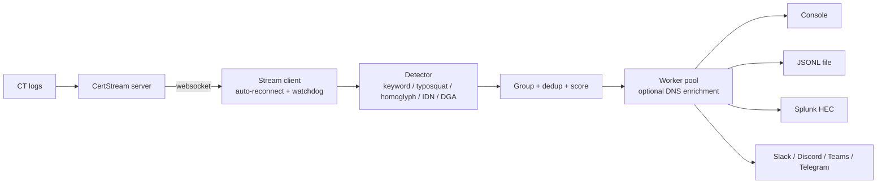

<div align="center">

# 🛡️ CertWatch

**Real-time Certificate Transparency monitor that catches phishing and brand-impersonation domains — the moment their TLS certificate is issued.**

[](https://github.com/YOUR_GITHUB_USERNAME/certwatch/actions)


</div>

---

Attackers need a valid HTTPS certificate to make a phishing site look legitimate, and every publicly trusted certificate is written to public **Certificate Transparency (CT) logs**. CertWatch listens to that firehose and flags domains that impersonate **your** brand — typically hours or days *before* the phishing campaign starts.

```text
CRITICAL  90 examplebank-secure-login.xyz  ~examplebank  Brand name inside registered domain; Phishing keyword: login, secure; Frequently abused TLD (.xyz)  ca=file-input
HIGH      80 login.examplebank.verify-account.top  ~examplebank  Brand name in sub-domain of an unrelated domain; Phishing keyword: login, verify, account; Frequently abused TLD (.top)  ca=file-input
MEDIUM    50 examplebnak.com  ~examplebank  Typosquat of 'examplebank' (edit distance 1, similarity 0.91)  ca=file-input
HIGH      75 exampleb4nk.net  ~examplebank  Homoglyph / look-alike characters (IDN or leetspeak)  ca=file-input
HIGH      75 examp1ebank.com  ~examplebank  Homoglyph / look-alike characters (IDN or leetspeak)  ca=file-input
HIGH      70 examplebank.co.uk  ~examplebank  Exact brand label on unofficial domain (examplebank.co.uk)  ca=file-input
CRITICAL  87 example-bank-support.click  ~examplebank  Brand name inside registered domain (hyphen-separated); Phishing keyword: support; Frequently abused TLD (.click)  ca=file-input
CRITICAL  85 xn--xamplebank-jsi.com (еxamplebank.com)  ~examplebank  Homoglyph / look-alike characters (IDN or leetspeak); IDN / punycode label  ca=file-input
HIGH      80 kdj39fkq0xz81mvpwq7.example-bank.icu  ~examplebank  Brand name inside registered domain (hyphen-separated); Frequently abused TLD (.icu); Random-looking label (possible DGA)  ca=file-input
```

## ✨ Features

| | |
|---|---|
| 🎯 **Multi-technique detection** | Brand keyword, typosquatting (Damerau-Levenshtein), homoglyphs / leetspeak, IDN (punycode) homographs, brand-in-subdomain tricks, phishing keywords, abused TLDs, DGA-looking labels |
| 📊 **Risk scoring** | Every finding gets a 0-100 score and a `LOW / MEDIUM / HIGH / CRITICAL` severity, so your SOC can triage instead of scroll |
| 🧠 **Low noise by design** | Official-domain allow-list, per-certificate grouping (`evil.xyz` + `www.evil.xyz` = one alert), TTL de-duplication, severity thresholds |
| 📤 **SIEM & alert ready** | Rich console, JSON Lines, **Splunk HEC**, Slack, Discord, Microsoft Teams, Telegram (domains are defanged in chat alerts) |
| 🔌 **Resilient** | Auto-reconnect with exponential back-off, stall watchdog, graceful `SIGINT`/`SIGTERM`, non-blocking workers so slow DNS/webhooks never stall the stream |
| 🚀 **Fast** | ~25k domains/sec on a single core in a benchmark with 3 brands — far above typical CT volume |
| 🐳 **Deployable** | `pip`, Docker (non-root image), systemd example, env-var configuration for secrets |
| 🧪 **Tested** | Unit + pipeline tests, CI on Python 3.9 – 3.13 |

## 🏗️ How it works



## 🚀 Quick start

```bash
git clone https://github.com/YOUR_GITHUB_USERNAME/certwatch.git
cd certwatch
python -m venv .venv && source .venv/bin/activate   # Windows: .venv\Scripts\activate
pip install .

# Watch a brand. Passing a domain also allow-lists it (your own certs are not reported).
certwatch -t examplebank.com
```

Try it **offline** first, no network needed:

```bash
certwatch -t examplebank.com --from-file examples/sample_domains.txt
```

### Docker

```bash
docker build -t certwatch .
docker run --rm -it certwatch -t examplebank.com

# daemon mode: JSONL to a named volume + Slack alerts from an env var
docker run -d --name certwatch --restart unless-stopped \
  -e CERTWATCH_SLACK_WEBHOOK="https://hooks.slack.com/services/XXX" \
  -v certwatch-data:/data \
  certwatch -t examplebank.com --quiet -o /data/findings.jsonl
```

## 🧰 Usage

```text
certwatch -t BRAND [-t BRAND ...] [options]
```

| Option | Description |
|---|---|
| `-t, --target` | Brand keyword **or** official domain. Repeatable / comma-separated. `-t examplebank.com` = brand `examplebank` + allow-listed `examplebank.com` |
| `--targets-file` | File with one brand per line |
| `-a, --allow` / `--allow-file` | Official domains to ignore (includes their sub-domains) |
| `--threshold` | Typosquat similarity, `0.5 - 1.0` (default `0.80`). Higher = stricter |
| `--min-severity` | Only report `low` (default) / `medium` / `high` / `critical` |
| `--resolve` | DNS-resolve matches; live domains get `+5` score and their IPs are recorded |
| `--url` | CertStream websocket (default public instance, or env `CERTSTREAM_URL`) |
| `--from-file` | Scan a list of domains offline instead of the live stream |
| `-o, --output` | Append findings to a JSON Lines file |
| `--details` | Full panel per finding instead of one line |
| `--quiet` | No banner / console findings, for daemons |
| `--splunk-url` `--splunk-token` `--splunk-index` | Splunk HTTP Event Collector |
| `--slack-webhook` `--discord-webhook` `--teams-webhook` | Chat alerts |
| `--telegram-token` `--telegram-chat-id` | Telegram alerts |
| `--alert-min-severity` | Minimum severity for chat alerts (default `high`) |
| `--test-alert` | Send one synthetic finding to every configured output and exit |

Recipes:

```bash
# Several brands, official domains allow-listed, DNS enrichment
certwatch -t examplebank -t examplepay -a examplebank.com -a examplepay.com --resolve

# Only page the SOC for serious stuff, keep everything in JSONL for forensics
certwatch -t examplebank.com -o all.jsonl --slack-webhook "$HOOK" --alert-min-severity critical

# Verify your integrations before going live
certwatch -t examplebank.com --splunk-url https://splunk:8088 --splunk-token "$T" --test-alert
```

> 💡 Prefer **environment variables** for secrets (`SPLUNK_HEC_TOKEN`, `CERTWATCH_SLACK_WEBHOOK`, `CERTWATCH_DISCORD_WEBHOOK`, `CERTWATCH_TEAMS_WEBHOOK`, `CERTWATCH_TELEGRAM_TOKEN`, `CERTWATCH_TELEGRAM_CHAT_ID`, `SPLUNK_HEC_URL`). Command-line arguments are visible in the process list.

## 🔍 Detection techniques

| Technique | Example (brand = `examplebank`) | Base score |
|---|---|---|
| Exact brand label on an unofficial domain | `examplebank.co.uk` | 70 |
| Brand inside the registered domain | `examplebank-secure-login.xyz` | 65 |
| Same, hyphen-separated | `example-bank-support.click` | 62 |
| **Homoglyph / leetspeak** | `examp1ebank.com`, `exampleb4nk.net` | 75 |
| **IDN homograph** (Cyrillic/Greek look-alikes) | `xn--xamplebank-jsi.com` → `еxamplebank.com` | 75 (+10 IDN) |
| Brand in a sub-domain of an unrelated domain | `examplebank.login.evil.top` | 55 |
| **Typosquat** (insert / delete / substitute / transpose) | `examplebnak.com` | 40 - 60 by similarity |

Bonus signals are added on top of a match (capped at 100):

| Signal | Points |
|---|---|
| Phishing keyword (`login`, `secure`, `verify`, `account`, `support`, …) | +15 |
| Frequently abused TLD (`.xyz`, `.top`, `.click`, `.icu`, …) | +10 |
| IDN / punycode label | +10 |
| Random-looking label, a heuristic for DGA (digits mixed into letters + high entropy) | +8 |
| 3+ hyphens | +5 |
| Domain already resolves in DNS (`--resolve`) | +5 |

Severity: `>= 85` **CRITICAL**, `>= 65` **HIGH**, `>= 45` **MEDIUM**, otherwise **LOW**.

The brand itself is stripped before bonus checks, so a brand such as `examplebank` never triggers the keyword or entropy signals on its own. Fuzzy matching is skipped for brands shorter than 5 characters, where it would only produce noise.

`--details` view of a finding:

```text
╭───────────────────  CRITICAL  ────────────────────╮
│ Domain      examplebank-secure-login.xyz          │
│ Brand       examplebank                           │
│ Score       90/100                                │
│ Reasons     - Brand name inside registered domain │
│             - Phishing keyword: login, secure     │
│             - Frequently abused TLD (.xyz)        │
│ Issuer      file-input                            │
│ Valid from  unknown                               │
│ SANs        examplebank-secure-login.xyz          │
╰───────────────────────────────────────────────────╯
```

## 📦 Output formats

### JSON Lines (`-o findings.jsonl`)

```json
{"timestamp": "2026-09-19T12:32:48+00:00", "severity": "CRITICAL", "domain": "examplebank-secure-login5.xyz",
 "target": "examplebank", "registered_domain": "examplebank-secure-login5.xyz", "score": 90,
 "reasons": ["Brand name inside registered domain", "Phishing keyword: login, secure", "Frequently abused TLD (.xyz)"],
 "unicode_domain": null, "issuer": "Let's Encrypt", "cert_fingerprint": "AA:BB:CC",
 "not_before": "2026-09-21T14:13:20+00:00", "not_after": "2026-12-20T14:13:20+00:00",
 "log_source": "Google 'Argon2026' log", "san_count": 2,
 "sans": ["examplebank-secure-login5.xyz", "www.examplebank-secure-login5.xyz"], "ips": [], "resolved": null}
```

### Splunk

Create an HEC token, then:

```bash
export SPLUNK_HEC_TOKEN=...   # never put tokens on the command line in production
certwatch -t examplebank.com --splunk-url https://splunk.example.com:8088 --splunk-index security
```

Events use `sourcetype=certwatch:finding`. Ready-made searches (alert, hunt, daily report) are in [`rules/splunk_alert.spl`](rules/splunk_alert.spl).

### Chat alerts

Slack, Discord, Teams and Telegram receive a compact message. Domains are **defanged** (`evil[.]xyz`) so nobody clicks a live phishing link by accident.

## 🖧 Running as a service

**systemd** (`/etc/systemd/system/certwatch.service`):

```ini
[Unit]
Description=CertWatch CT monitor
After=network-online.target
Wants=network-online.target

[Service]
User=certwatch
EnvironmentFile=/etc/certwatch.env          # SPLUNK_HEC_TOKEN=..., CERTWATCH_SLACK_WEBHOOK=...
ExecStart=/opt/certwatch/.venv/bin/certwatch -t examplebank.com --quiet -o /var/log/certwatch/findings.jsonl --splunk-url https://splunk.example.com:8088
Restart=always
RestartSec=5
NoNewPrivileges=true

[Install]
WantedBy=multi-user.target
```

## 📡 About the data source

CertWatch consumes the [CertStream](https://github.com/CaliDog/certstream-server) websocket protocol. The public demo instance is convenient for trying the tool, but it is a shared, best-effort service and can disconnect or be unavailable. CertWatch reconnects automatically, but for production you should **self-host** a CertStream-compatible server, for example [certstream-server-go](https://github.com/d-rickyy-b/certstream-server-go):

```bash
docker run -d -p 8080:8080 0rickyy0/certstream-server-go
certwatch -t examplebank.com --url ws://localhost:8080
```

Use the default `/` (lite) or `/full-stream` endpoint. CertWatch needs the `leaf_cert.all_domains` field, which the `/domains-only` endpoint does not provide.

## 🎛️ Tuning and false positives

- **Always allow-list your official domains** (`-a` or `-t yourbrand.com`). Otherwise your own certificate renewals will be reported.
- Short or common-word brands (e.g. `maskan`) match more legitimate domains. Raise `--min-severity` to `medium` or `high`, or use a longer brand string such as `bankmaskan`.
- Raise `--threshold` (e.g. `0.9`) to reduce typosquat noise; lower it (e.g. `0.75`) to catch more.
- Use `--targets-file` for many brands, one per line (`#` comments are allowed).

## ⚠️ Limitations and operational notes

- CT logs show that a certificate **was issued**, not that the site is malicious. Treat findings as leads to triage. Scores are heuristics, not verdicts.
- Attackers can avoid CT entirely by using plain HTTP or by relying on shared hosting with an existing wildcard certificate.
- `--resolve` makes DNS queries for attacker-controlled domains. Their authoritative name servers can see the lookup, so use a resolver/egress you are comfortable with.
- CertWatch is **passive**: it only reads public CT data and never contacts the suspicious sites. Use it for defensive brand protection and threat detection only.

## 🧪 Development

```bash
pip install -e ".[dev]"
pytest -q
```

Project layout:

```text
certwatch/
├── certwatch/
│   ├── cli.py        # argument parsing, wiring, signal handling
│   ├── detector.py   # all detection logic (pure, no I/O)
│   ├── engine.py     # grouping, dedup, worker pool, enrichment
│   ├── stream.py     # websocket client: reconnect + watchdog
│   ├── outputs.py    # console / JSONL / Splunk / chat sinks
│   ├── enrich.py     # DNS resolution
│   └── models.py     # Finding dataclass, severities
├── tests/
├── rules/splunk_alert.spl
├── examples/sample_domains.txt
├── Dockerfile
└── pyproject.toml
```

## 🗺️ Roadmap

- [ ] Optional threat-intel enrichment (VirusTotal / urlscan / WHOIS age)
- [ ] Prometheus metrics endpoint
- [ ] Sigma rules and Elastic / OpenSearch output
- [ ] YAML config file
- [ ] Brand logos / page-similarity checks on resolving domains

Ideas and pull requests are welcome. Please add a test for any new detection technique.

## 📄 License

[MIT](LICENSE)

## 👤 Author

**Amirhossein** — Blue Team / SOC

[GitHub](https://github.com/YOUR_GITHUB_USERNAME) · [LinkedIn](https://www.linkedin.com/in/YOUR_LINKEDIN)

If CertWatch helps your team, a ⭐ on the repo is much appreciated.
